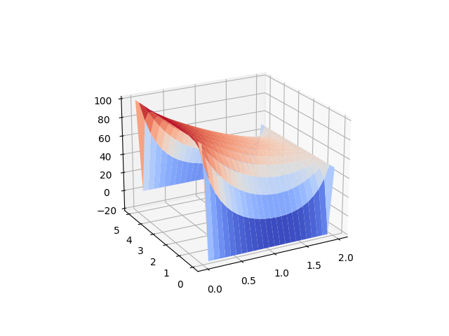
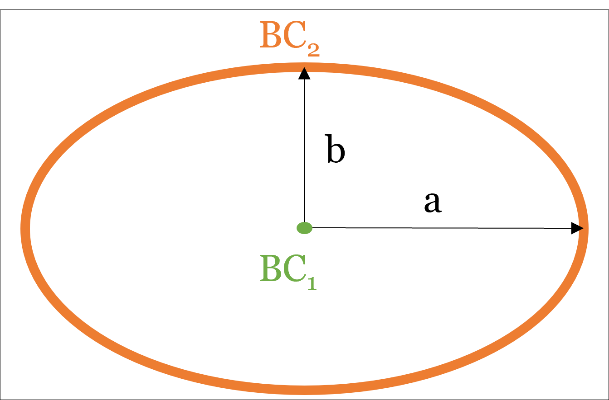

# PDE Solver DY

This PDE solver is part of a project for the Advanced Programming course. It is concerned with the solution of the homogenous 2D heat transfer equation (LaPlace’s equation) for the steady-state case. It is based on C++ and is currently supported on Linux OS.

## Installation

### Prerequisites
The program assumes that the following tools and libraries are setup properly on the Linux OS:
- Git
- Make
- CMake
- Python (v3)
```
sudo apt-get install python3-dev
```
- Python pip
```
sudo apt install python3-pip
```
- Python numpy
```
sudo apt-get install python-numpy
```
- Matplotlib
```
pip install matplotlib
```
- Python GUI
```
sudo apt-get install python3-tk
```
- Install Eigen libray (v3.0)
```
sudo apt install libeigen3-dev
```

### Git cloning
Clone the git repository using the following code
```
git clone https://gitlab.lrz.de/00000000014AE223/pde-solver-dy.git
```
### Building and Running
Inside the `/build` folder, run `cmake ../src` command. Then inside the `/build` folder run `make` command. Finally, open the executable file using `./pde_solver` command inside the `/build` folder.


## Sprint 1 (v1.0)
### Introduction
The solver implementation in this version is limited to a simple rectangular 2D domain in the cartesian coordinate system (i.e. _x_ and _y_). The problem definition is summarized in the figure below.

<div style="text-align:center">
    
</div>

In this version, only Dirichlet boundary conditions are allowed for continuous homogeneous materials (only a single material for the whole domain is expected).

The user inputs and their corresponding restrictions are:
1.	Domain specification (double, double)
    -	Major dimensions: the width and height of the rectangle (_W_ and _H_, respectively). Must be greater than 0 and with compatible units.
2.	Mesh specification (int, int)
    -	Number of nodes in each direction (*n_x* and *n_y*), step size is calculated accordingly. Must be integers and greater than 1.
3.	Boundary conditions (double, double, double, double)
    -	Currently, only Dirichlet BCs are supported. Therefore, 4 temperature values are required according to the diagram above (_T1_, _T2_, _T3_, and _T4_). Temperature values are in degree Celsius.

The 5-point finite difference scheme, demonstrated in the figure below, is used to discretize the 2D heat transfer equation. The resulting linear system is solved using the LU-factorization method. 

<div style="text-align:center">
     <br/>
    
     
</div>

### Outputs
After execution of the simulation with all input parameters, a CSV file (`results.csv`) can be found in the `/results` folder of the project containing all of the information required. The format of this __comma-separated__ file is as follows:
- Node number, 1st coordinate, 2nd coordinate, BC (1/0), T_sim, T_analytic, error

Also, if dependencies are installed correctly, a 3D plot for the simulated temperature values will be generated. Finally, the code outputs to the console the maximum, minimum, and average values of the error percentage. (if the test case option is selected).

### Test case
The simple unit test implemented for the testing of the numerical simulation accuracy is defined as special case of the general problem presented before. Only two temperature values (_T1_ and _T2_) are expected as BCs, and the inhomogeneous case is not supported. This special case is presented below:


<div style="text-align:center">
    
</div>

For this problem, the analytical solution for the temperature value (_T_) for any point inside the domain is given by:

<div style="text-align:center">
    
</div>

Results from the analytical solution is compared with the grid values obtained from the numerical solution. The error percentage for each node is calculated and the maximum, minimum, and average values are reported to the console.

### Example usage
In the `/build` folder, use the command `make` to build the executable file. Then, use the command `./pde_solver`.

#### Test case 1:

Set Width to: 1

Set Height to: 1

Set Nodes in X direction to: 11

Set Nodes in Y direction to: 11

Set Run unit test to: 1

Set Temperature T1 to: 0

Set Temperature T2 to: 100

Check `../results/results.csv` file with the details of the results.

<div style="text-align:center">
    
</div>

##### Basic case

Set Width to: 2

Set Height to: 5

Set Nodes in X direction to: 25

Set Nodes in Y direction to: 18

Set Run unit test to: 0

Set Temperature T1 to: -20

Set Temperature T2 to: 100

Set Temperature T3 to: 50

Set Temperature T4 to: 0

Check `../results/results.csv` file with the details of the results.


<div style="text-align:center">
    
</div>


## Sprint 2 (v2.0)
### What's new?

The solver from Sprint 1 (v1.0) is now extented with more functionality using the OOP structure. The following is a summary of the newly added features:

1. **New coordinate system**, Polar coordinates. Now it's possible to choose from the Cartesian (eg. square, rectangle) or the Polar coordinates (eg. circle or oval).
2. **Neumann Boundary conditions** (d_u/d_n = constant). The user can now choose either one of BC types (Dirichlet or Neumann) for each boundary in the problem. Note: at least one Dirichlet boundary condition should be present to arrive at a unique solution.
3. **Inhomogenous problem** (i.e. Poisson's equation).
4. **New numerical solvers**. 
    - _Special LU_ scheme to utilize the sparse structure of the matrix (much faster than classical)
    - _Gauss-seidel_ (iterative solver requiring max number of iterations, relaxation factor, and max value of the residual norm)

### Main user inputs

An updated list for the main user inputs and the corresponding restrictions:

1. **Coordinate system** (int - Cartesian = 1, Polar = 2)
2. **Domain type** (int - rectangle, square [only one input required], circle, or oval). Each coordinate system restricts the possible domain types to choose from.
3.	**Domain specification** (double, double)
    -	Major dimensions: the width and/or height of the rectangle/square, or the radius (for a circle), or minor and major radii (for oval). Must be greater than 0 and with compatible units.
4. (for inhomogenous case) **Value and location of heat source/sink** (double, double, double)
    - The location of the heat source/sink must be inside the specified domain. The provided location is then applied to the nearest node in the mesh.
5.	**Mesh specification** (int, int)
    -	Number of nodes in each direction (*n_x* and *n_y*), step size is calculated accordingly. Must be integers and greater than 1.
6. **Boundary condition types** (int, int, int, int)
    - Only two possible options (Dirichlet or Neumann). At least one Dirichlet BC should be specified for a unique solution.
7.	**Boundary condition values** (double, double, double, double)
    -	Four temperature or heat source/sink values are required for Dirichlet and Neumman BCs, respectively, according to the diagram below (_BC1_, _BC2_, _BC3_, and _BC4_ for Cartesian domain OR _BC1 and _BC2_ for Polar case). TODO: check
8. **Solver** (int)
    - Current available solvers: classical LU factorization, LU-Sparse, Gauss-Seidel

<div style="text-align:center">
    
    
    
</div>

### Outputs

After execution of the simulation with all input parameters, a CSV file (`results.csv`) can be found in the `/results` folder of the project containing all of the information required. The format of this __comma-separated__ file is as follows:
- Node number, 1st coordinate, 2nd coordinate, BC (1/0), T_sim, T_analytic (if test case chosen), error (if test case chosen)

Also, if dependencies are installed correctly, a 3D plot for the simulated temperature values will be generated. Finally, the code outputs to the console the maximum, minimum, and average values of the error percentage. (if the test case option is selected).

### Extending the functunality

Due to the structure of the current implementation, a new feature can be added to extend the functionality of the solver. The following is a list of possible extensions that can be carried out to add more features to the current version:

1. **Beyond Elliptic PDE Heat equations**
    - Although the main purpose of this solver is to solve the 2D Poisson's heat equation, it has been implemented with the possibility to solve other types of PDE models in mind. 
    - This can be done by creating a child class of the `Initiation` base class and providing the required paramters to the `Initiation` constructor. 
    - The code is already equipped with three PDE Types (_Elliptic_, _Hyperbolic_, and _Parabolic_) with the Elliptic case being the default value. The pure virtual getter functions must be declared in the new child class. 
2. **More coordinate systems**
    - The current solver considers _Cartesian_ and _Polar_ systems. 
    - This can simply be extended by adding other systems such as cylinderical, spherical, barycentric, or curvilinear to the `CoordinateSystem` enum class defined in `Initiation` header. 
    - The current coordinate systems are being used as part of the workflow logic in different classes and methods (w.o.l.g. setting inhomogenity values or, generally, boundary conditions  in `EllipticPDE`, grid generation in `Mesh`, setting up the system matrix and the RHS `b` vector in `Solver`, possible shapes and domain sizing in `Domain`). Since each coordinate system will need special considerations for the aforementioned examples, the current logic need to be extended for the newly added coordinate system.  
3. **More shapes for each coordinate system**
    - To add a new domain shape (eg. triangle, hollow circle/oval, or hollow square), each shpae need to be restricted to only a single coordinate system. 
    - If a shape needs to be defined with more than 2 values, the `_major_dimensions` array size needs to be adjusted accordingly in `Domain`. In addition, the number of possible boundary conditions need to be defined using the currently implemented shaapes as an example in the `Domain` constructor. In the `Mesh`, the logic needs to incorporate how to handle the grid generation of this new shape.
4. **Different meshing strategy**
    - Structured rectangular mesh (consistent step sizes in all dimensions) is the only option being employed in this version of the solver. 
    - To add/define other grid generation schemes such as unstructured mesh or triangle mesh, the `MeshType` enum class can be extended accordingly. The default option of `__mesh_type` is the rectangular structured grid. This can be explicity defined by the user and the program can handle this case independently in `Mesh` constructor. 
    - Any new scheme must always abide by the format of the `__mesh` matrix. Any further information that needs to be stored should be stored in a new matrix/vector (such as the nodes and sides numbers of a certain triangular element), this still needs to be a _protected_ class member.  
6. **More numerical solvers**
    - Besides the implemented classical LU factorization, LU-sparse, and Gauss-Seidel solvers, other direct or iterative solvers can be defined such as Jacobi, Gauss elimination, or banded solver to name a few. TODO


### Example Case

TODO