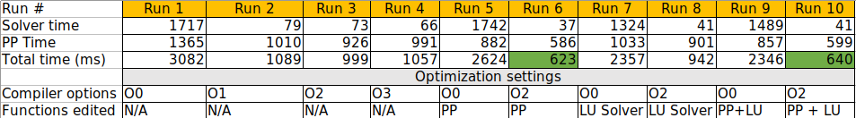
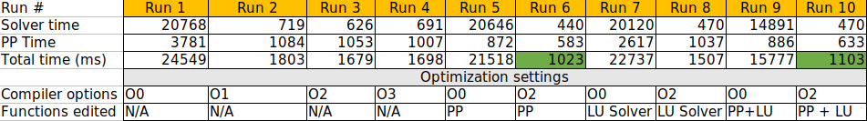
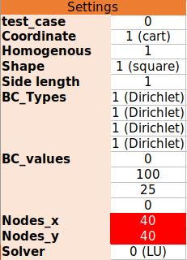
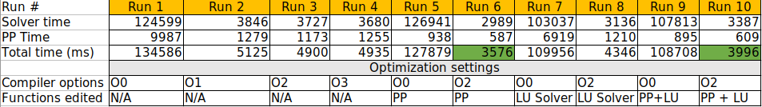

# PDE Solver DY - Performance analysis

In this document, you can find the performance analysis done to our project. In here, we focus on general and focused improvements. The general improvements resulted on an improvement in performance for every possible usage of the software. After the initial explorations, we found that the main bottlenecks of the software were:

- Direct LU factorization method.
- Postprocessing of the results, i.e. plotting.
- Allocation and access of vectors and matrices.

## General improvements

- Removing costly operations such as pow() inside loops.
- Dereferencing pointers outside loops and save them in local variables to avoid expensive memory accesses.
- Using the optimization options of the Compiler to allow vectorization.

## Focused improvements

- Use the std::vector::reserve() method when possible to optimize the allocation of the values in matrices and vectors. This was specially implemented in the PostProcessing::plotResult() and the LU_Direct::LUFactorization() methods.
- Implemented (since Sprint2) the sparse LU method using the Eigen library to exploit the sparse structure of the matrices and vectors generated in the FDM method.
- Transposing the __mesh obtained via Mesh::getMesh(), converting it to a row-wise matrix, improving the cache load and access of this data structure, which was heavily used in the PostProcessing::plotResult() method.

## Profile of the code before improvements

Before any improvements on the code, the distribution of the profile was as follows:

```
Each sample counts as 0.01 seconds.
  %   cumulative   self              self     total           
 time   seconds   seconds    calls  ms/call  ms/call  name    
 45.65      0.21     0.21        1   210.01   429.52  LU_direct::LUFactorization()
 26.09      0.33     0.12 85660260     0.00     0.00  std::vector<double, std::allocator<double> >::operator[](unsigned long)
 21.74      0.43     0.10 85738382     0.00     0.00  std::vector<std::vector<double, std::allocator<double> >, std::allocator<std::vector<double, std::allocator<double> > > >::operator[](unsigned long)
  4.35      0.45     0.02        4     5.00     5.16  std::vector<std::vector<double, std::allocator<double> >, std::allocator<std::vector<double, std::allocator<double> > > >::reserve(unsigned long)
  2.17      0.46     0.01       62     0.16     0.16  std::vector<std::vector<double, std::allocator<double> >, std::allocator<std::vector<double, std::allocator<double> > > >::size() const
```

## Profile of the code after improvements

After the implementations of the mentioned improvements, it has the following distribution:

```
Each sample counts as 0.01 seconds.
  %   cumulative   self              self     total           
 time   seconds   seconds    calls   s/call   s/call  name    
 99.71      3.36     3.36        1     3.36     3.36  LU_direct::LUFactorization()
  0.30      3.37     0.01        1     0.01     0.01  LU_direct::forwardSubstitution(std::vector<double, std::allocator<double> > const&)
  0.00      3.37     0.00  3840800     0.00     0.00  void std::vector<double, std::allocator<double> >::emplace_back<double>(double&&)
  0.00      3.37     0.00     3200     0.00     0.00  std::vector<double, std::allocator<double> >::reserve(unsigned long)
  0.00      3.37     0.00     1605     0.00     0.00  Initiation::isTestCase() const
  0.00      3.37     0.00     1600     0.00     0.00  void std::vector<std::vector<double, std::allocator<double> >, std::allocator<std::vector<double, std::allocator<double> > > >::emplace_back<std::vector<double, std::allocator<double> > >(std::vector<double, std::allocator<double> >&&)
```

## Performance in different scenarios

We further explored the performance of our code in three different scenarios for the critical methods mentioned above. The results are shown below:

### Scenario 1

<div style="text-align:left">
  
</div>

<div style="text-align:left">
  
</div>

### Scenario 2

<div style="text-align:left">
  
</div>

<div style="text-align:left">
  
</div>

### Scenario 3

<div style="text-align:left">
  
</div>

<div style="text-align:left">
  
</div>

## Remarks

- The performance was improved heavily through the optimizations options of the compiler and the changes in the postprocessing.
- Despite the improvement of the LU Factorization was not so evident in the timing, reserving space made a better use of the memory and avoided constant resizing of the vectors and matrices.
- The general improvements of the code also had a small but positive impact on the performance.

### Possible further improvements

Further improvements can be foreseen by implementing a class for the boundaries, which allows us to avoid multiple flow control statements while setting up the matrices and vectors of the FDM system of equations. Also, using dependancy injection to make the code more compact and readable could also provide means to improve the code faster and with impact in the multiple numerical methods of the solver.